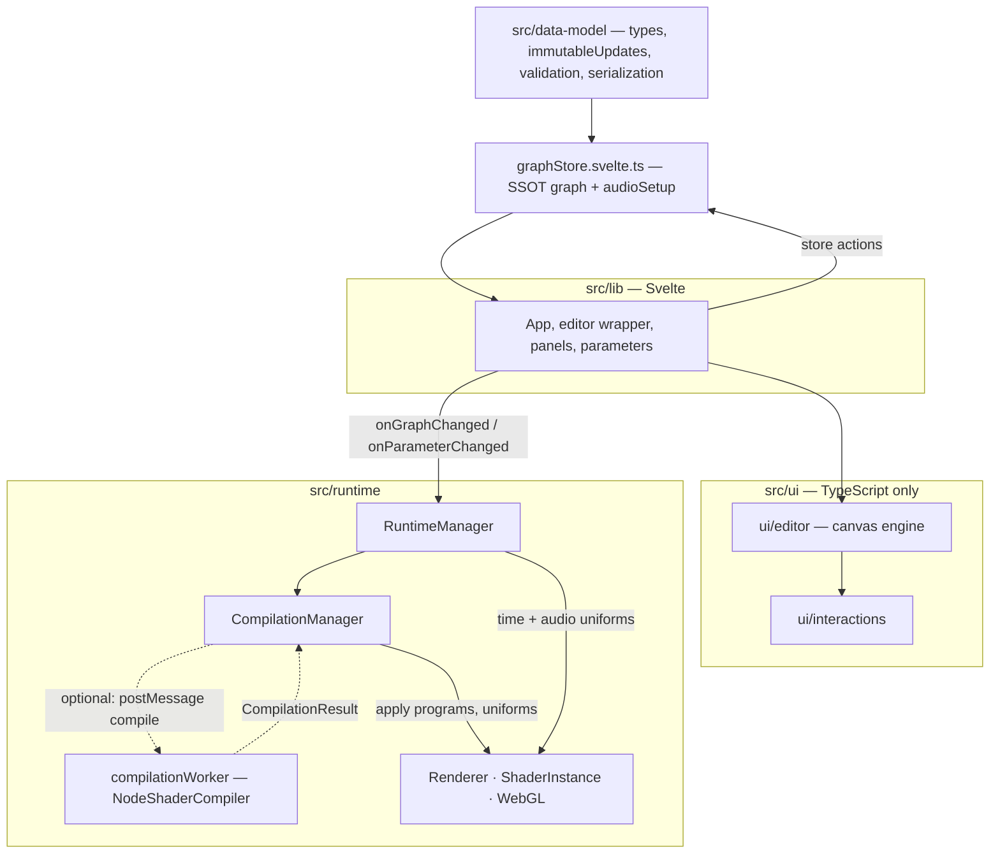

# Architecture documentation

**Last updated:** 2026-05-14

This folder describes **how the codebase is shaped**: ownership of the graph, control flow from UI to WebGL, where compilation runs (main thread vs worker), and where major subsystems live. **Product behavior** for users is specified in [`docs/user-goals/`](../user-goals/README.md). **Delivery tasks and experiments** live in [`docs/implementation/`](../implementation/README.md).

## System at a glance

Solid arrows are the **primary preview path**: graph edits and parameters flow **store → App callbacks → runtime → GPU**. When no worker is configured, `CompilationManager` runs `NodeShaderCompiler` **in the same process** instead of the dashed worker leg. **Detail:** [parameters-pipeline](./parameters-pipeline.md), [preview-and-recompilation](./preview-and-recompilation.md), [compilation-worker](./compilation-worker.md), [editor-ui-canvas-layout](./editor-ui-canvas-layout.md).

## Quick answers (~10 minutes)

| Question | Where to read |
| --- | --- |
| Where does the graph live? Who mutates it? | [`graph-and-platform-boundaries.md`](./graph-and-platform-boundaries.md) — `src/data-model/`, `src/lib/stores/graphStore.svelte.ts` |
| How does a parameter change reach the shader? | [`parameters-pipeline.md`](./parameters-pipeline.md) — store → App → `RuntimeManager` → `CompilationManager` → `ShaderInstance` |
| When does recompilation run vs uniform-only updates? | [`parameters-pipeline.md`](./parameters-pipeline.md) and [`preview-and-recompilation.md`](./preview-and-recompilation.md) — debounced kicks use idle/timer → **one** `requestAnimationFrame` before `recompile()` |
| Where does GLSL compilation run (main vs worker)? | [`compilation-worker.md`](./compilation-worker.md) — `src/runtime/compilation/compilationWorker.ts` vs in-process |
| How does audio drive connected parameters? | [`audio-reactivity.md`](./audio-reactivity.md) — compiler wiring + `TimeManager` / `AudioParameterHandler` |
| Where is Svelte vs canvas TypeScript? | [`editor-ui-canvas-layout.md`](./editor-ui-canvas-layout.md) — `src/lib/` vs `src/ui/` |
| How do I enable the **adaptive preview (P2) DPR** dev experiment? | [`adaptive-preview-p2-toggle.md`](./adaptive-preview-p2-toggle.md) — **not** a shipped user setting; `localStorage` key `shadernoice.previewAdaptive` or `__previewSchedulerDebug.setAdaptivePreview` (see [`PRODUCTIZATION.md`](./PRODUCTIZATION.md)) |
| **Manual QA:** adaptive × WebGL/WebGPU preview × image export | [`INTEGRATION-QA-CHECKLIST.md`](./INTEGRATION-QA-CHECKLIST.md) — sign-off matrix for releases / risky changes |
| Optional **WebGPU preview dependency clock** (`?webgpuPreviewDependencyClock=`) | [`preview-and-recompilation.md`](./preview-and-recompilation.md) — *Optional developer URL flags*; `src/runtime/webGpuPreviewDependencyClock.ts` |
| **WebGL vs WebGPU** session preview + export (one raster API per session/job) | [`webgl-webgpu-preview-export.md`](./webgl-webgpu-preview-export.md) — policy; [`COVERAGE-MATRIX.md`](./COVERAGE-MATRIX.md), [`PARITY-PLAN.md`](./PARITY-PLAN.md) |

## Suggested reading order

1. **`graph-and-platform-boundaries.md`** — Immutable graph, store, runtime seams, serialization entry points.
2. **`parameters-pipeline.md`** — End-to-end parameter changes and `ParameterValue` types.
3. **`preview-and-recompilation.md`** — Graph updates, debouncing, idle vs immediate scheduling, preview instrumentation.
4. **`compilation-worker.md`** — Worker protocol and what stays on the main thread.
5. **`audio-reactivity.md`** — Execution order, uniforms, per-frame updates.
6. **`editor-ui-canvas-layout.md`** — Editor folder layout and lib ↔ canvas bridge.

## Document map

| Document | Purpose |
| --- | --- |
| [graph-and-platform-boundaries.md](./graph-and-platform-boundaries.md) | Single source of truth for the graph, immutability, change detection, validation/serialization touchpoints, runtime-only parameter concept, errors at compile boundaries. |
| [parameters-pipeline.md](./parameters-pipeline.md) | UI → store → runtime → uniform vs recompile decisions; `ParameterValue` matrix; key files. |
| [preview-and-recompilation.md](./preview-and-recompilation.md) | `setGraph` / structure vs parameter paths, `CompilationManager` scheduling, interaction with `PreviewScheduler`, reliability notes. |
| [adaptive-preview-p2-toggle.md](./adaptive-preview-p2-toggle.md) | **Dev-only** adaptive preview DPR cap + settle; `localStorage` and `__previewSchedulerDebug` (`?previewOverlay`). Product stance: [`PRODUCTIZATION.md`](./PRODUCTIZATION.md). Manual QA: [`INTEGRATION-QA-CHECKLIST.md`](./INTEGRATION-QA-CHECKLIST.md). |
| [DRAWING-BUFFER-AUDIT.md](./DRAWING-BUFFER-AUDIT.md) | WebGL **`preserveDrawingBuffer`** + readback audit for preview/export; recommendation to **keep `true`** until an explicit resolve path exists. |
| [GAP-INVENTORY.md](./GAP-INVENTORY.md) | WebGPU compile failure patterns vs graph-valid cases; prioritizes wire-time guards (companion to wire-validation design). |
| [webgl-webgpu-preview-export.md](./webgl-webgpu-preview-export.md) | Exclusive WebGL2 vs WebGPU preview/export: invariants, hard block UX, session export inheritance; links coverage matrix + parity plan. |
| [COVERAGE-MATRIX.md](./COVERAGE-MATRIX.md) | WGSL MVP vs export axes, pass-plan kinds, `unsupportedReasons` taxonomy, export gate test index. |
| [PARITY-PLAN.md](./PARITY-PLAN.md) | CI vs `test:webgpu-golden`, RMS thresholds, “drop WebGL” checklist. |
| [WIRE-VALIDATION-DESIGN.md](./WIRE-VALIDATION-DESIGN.md) | Mode-aware WebGPU connection validation (Phase 1 rules, API shape, non-goals). |
| [compilation-worker.md](./compilation-worker.md) | Optional Web Worker for `NodeShaderCompiler`; message flow; factory wiring; main-thread `applyCompilationResult`. |
| [audio-reactivity.md](./audio-reactivity.md) | Parameter connections to audio, compiler invariants, `TimeManager` policy for audio uniform passes. |
| [editor-ui-canvas-layout.md](./editor-ui-canvas-layout.md) | `src/lib/components/*` vs `src/ui/editor/*` and interactions; where to add UI vs canvas code. |
