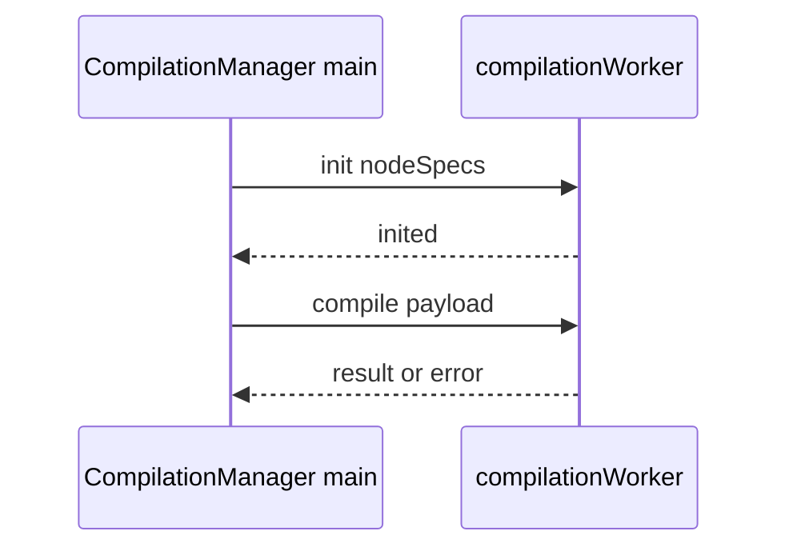

# Compilation Web Worker

**Last updated:** 2026-05

Graph → GLSL compilation can run **off the main thread** in a dedicated worker while **WebGL program build and rendering** stay on the main thread. This document is the **contract reference** for that boundary.

## What runs where

| Work | Thread |
| --- | --- |
| `NodeShaderCompiler.compile` / `compileIncremental` | Worker **when** `createRuntimeManager` is called with `nodeSpecsForWorker`; otherwise **main** (same process as UI) |
| `applyCompilationResult` (new `ShaderInstance`, parameter transfer, `renderer.setShaderInstance`, render) | **Main** only |
| Export / video pipeline `compiler.compile(...)` | **Main** (does not use `CompilationManager` worker) |

## Message flow

Payload and reply shapes are defined in [`src/runtime/compilation/workerMessages.ts`](../../src/runtime/compilation/workerMessages.ts). The worker entry is [`src/runtime/compilation/compilationWorker.ts`](../../src/runtime/compilation/compilationWorker.ts).

### Worker responsibilities

- **`init`** — Build a `Map` of `NodeSpec`, construct **`NodeShaderCompiler`**, reply `{ type: 'inited' }`.
- **`compile`** — Receive graph, optional `audioSetup`, optional `previousResult` ( **`null` when `tryIncremental` is false** so the main thread avoids cloning the last snapshot for full compiles), `affectedNodeIds`, `tryIncremental`. Run incremental compile when allowed; fall back to full **`compile`**. Reply `{ type: 'result', id, result }` or `{ type: 'error', id, message }`.

### Main-thread responsibilities

- Create the worker and send **`init`** (see [`src/runtime/factories.ts`](../../src/runtime/factories.ts) — dynamic `import(...?worker)` and `waitForWorkerInited`).
- Post **`compile`** with a **structured-cloneable** payload (see `cloneableCompilePayload` in `CompilationManager`).
- On **`result`**, ignore stale `id`s, then call **`applyCompilationResult`** inside error handling.
- On **`cancelPendingRecompile`**, bump compile id so late worker messages are ignored.
- **`recompileAfterContextRestore`** — Uses **synchronous main-thread compile** when a worker is configured, so restore does not wait on async worker round-trip.
- **`destroy`** — Terminate the worker.

### Worker-safe imports

The worker may import the compiler stack, **`data-model`** types, and other pure TS. It must **not** import DOM, WebGL, `CompilationManager`, `Renderer`, or `ShaderInstance`.

## Factory wiring

- **`createRuntimeManager(canvas, compiler, errorHandler?)`** — No worker; compilation runs in-process on the main thread.
- **`createRuntimeManager(canvas, compiler, errorHandler?, nodeSpecsForWorker)`** — Creates worker, inits compiler inside worker, passes worker into **`createCompilationManager(..., worker)`**.

The app obtains node specs when building the editor compiler and passes them into `createRuntimeManager` so preview compilation can offload.

### Testing

Vitest **`src/runtime/compilation/workerMessages.test.ts`** guards **structured-clone / JSON** stability of compile payloads and the shape of worker **reply** messages (`result`, `error`, `inited`) so main-thread apply logic and the worker stay aligned when fields are added or refactored.

---

## Appendix: Historical implementation checklist

The worker was introduced with an explicit implementation checklist (worker file, message types, `applyCompilationResult` extraction, compile-id stale guards, context-restore bypass, factory and App wiring). That work is **merged**; the list is kept here only as a **migration log** for anyone diffing old branches. Source of truth for behavior is **`compilationWorker.ts`**, **`workerMessages.ts`**, and **`CompilationManager.ts`**.
