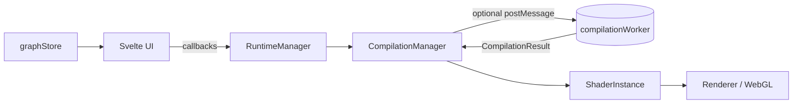

# Graph, stores, and platform boundaries

**Last updated:** 2026-05

The **node graph** (nodes, connections, view state, automation metadata) is owned by the **data model** and exposed through a **Svelte 5 module store**. **Runtime and compilation read the graph**; they do not mutate it in place. This page is the canonical description of that boundary and of related seams (types, serialization, connections, change detection, runtime-only parameters).

## Graph ownership and immutability

- **Types** — `NodeGraph`, `NodeInstance`, `Connection`, `ParameterValue`, etc. live in [`src/data-model/types.ts`](../../src/data-model/types.ts). [`src/types/nodeGraph.ts`](../../src/types/nodeGraph.ts) re-exports those types and narrows file-format shapes; it is not a second graph implementation. Optional **`bypassed?: boolean`** on **`NodeInstance`** records per-node Power (serialized like other node fields); the compiler interprets it at compile time—the runtime does not simulate bypass separately from the shader (see [`docs/implementation/node-power/_OVERVIEW.md`](../implementation/node-power/_OVERVIEW.md)).
- **Updates** — Pure updaters in [`src/data-model/immutableUpdates.ts`](../../src/data-model/immutableUpdates.ts) (`updateNodeParameter`, `addNode`, `removeConnection`, …) return a **new** graph reference.
- **Store** — [`src/lib/stores/graphStore.svelte.ts`](../../src/lib/stores/graphStore.svelte.ts) holds `$state` for the graph and audio setup; actions call immutable updaters then assign `graph = …`.

[`src/utils/changeDetection/GraphChangeDetector.ts`](../../src/utils/changeDetection/GraphChangeDetector.ts) assumes **reference equality means no change** (`oldGraph === newGraph`). Any in-place mutation of an object still held by the store would break change detection and incremental compilation.

### Runtime behavior (current)

- **`RuntimeManager.updateParameter`** accepts the graph **after** the store update. It syncs `currentGraph`, calls `compilationManager.setGraph(graph)` when a graph is passed, handles **runtime-only** parameters without touching shader uniforms, and otherwise delegates to `CompilationManager.onParameterChange`. It does **not** write into `node.parameters` on the store’s reference.
- **`CompilationManager`** uses `this.graph` for hashing, connection lookup, and uniform vs recompile decisions; it does not mutate the graph.

## Control flow (stable boundaries)

- **Graph → GLSL** may run inside [`src/runtime/compilation/compilationWorker.ts`](../../src/runtime/compilation/compilationWorker.ts) when the app constructs the runtime with node specs for worker init (see [`compilation-worker.md`](./compilation-worker.md)).
- **Program creation, `ShaderInstance`, and drawing** stay on the **main thread** (`applyCompilationResult` in `CompilationManager`).

## Serialization and validation

Supported save/load uses [`src/data-model/serialization.ts`](../../src/data-model/serialization.ts): `serializeGraph` / `deserializeGraph` with format version checks and **`validateGraph`**. Presets and default/local persistence go through this path. New ingest paths (URL loaders, tests) should use the same pipeline so invalid graphs never reach the runtime or compiler.

## Connection model

`Connection` is defined in `data-model/types.ts`: port targets use `targetPort`; parameter wiring uses `targetParameter`. Validation enforces **exactly one** of those targets and stable dedupe keys via [`src/data-model/connectionUtils.ts`](../../src/data-model/connectionUtils.ts) (`getConnectionTargetKey`, `isPortConnection`). User-visible rules are aligned with [`docs/user-goals/05-connections.md`](../user-goals/05-connections.md).

## Change detection and compilation

Two layers both use graph diffing, for different jobs:

1. **`RuntimeManager`** — Skips heavy work for layout-only changes (`isOnlyPositionChange`), decides cleanup and **immediate** vs debounced recompile for structure changes, and treats some automation edits as not requiring shader recompile.
2. **`CompilationManager.recompile`** — Uses `detectGraphChanges` for **full vs incremental** compile and to maintain metadata for the next comparison.

Incremental compile is used when connections are unchanged, a previous result exists, and the set of affected nodes is small enough; connection changes force a full compile path.

### Who calls what (change detection)

- **`GraphChangeDetector`** ([`src/utils/changeDetection/GraphChangeDetector.ts`](../../src/utils/changeDetection/GraphChangeDetector.ts)) — Single implementation of `isOnlyPositionChange`, `detectChanges`, automation-only helpers, and affected-node tracking. Assumes immutable graphs (`oldGraph === newGraph` means no change).
- **`RuntimeManager.setGraph`** — Delegates `isOnlyPositionChange` to `GraphChangeDetector.isOnlyPositionChange`. On non–layout-only edits it calls `GraphChangeDetector.detectChanges` (structure path) and `isOnlyAutomationRegionTimesChange` to drive `CompilationManager.onGraphStructureChange` and audio cleanup.
- **`CompilationManager.detectGraphChanges` (private)** — Calls `GraphChangeDetector.detectChanges` with `trackAffectedNodes: true` / `includeConnectionIds: true`, then updates `previousGraph` / `previousGraphState` for the next compile.
- **`graphUpdate` (editor)** — [`src/ui/editor/graphUpdate.ts`](../../src/ui/editor/graphUpdate.ts) uses `GraphChangeDetector.detectChanges` after applying a graph patch to invalidate connection layers (incremental UI), not to schedule compilation.

`detectGraphChanges` as a **method name** exists only on **`CompilationManager`** (it wraps `GraphChangeDetector.detectChanges`). There is also a legacy helper file [`src/utils/graphComparison.ts`](../../src/utils/graphComparison.ts) with a parallel `isOnlyPositionChange`; new code should prefer **`GraphChangeDetector`** so runtime and compiler stay aligned.

### Edit kind → RuntimeManager vs CompilationManager

Parameter vs structure paths for uniforms and scheduling are detailed in [`parameters-pipeline.md`](./parameters-pipeline.md). This table summarizes **who reacts** after the store has produced a new graph reference:

| Edit kind (store / graph shape) | `RuntimeManager` / `setGraph` | `CompilationManager` expectation |
| --- | --- | --- |
| View-only pan / zoom / selection (`updateViewState`, `recordUndo: false`) | `graphChangedListener` runs for autosave / revision counters; **shader runtime** is not driven by view-only edits alone. | No compile triggered solely from view state. |
| Node **move** only (positions change; same nodes, connections, parameters) | **`isOnlyPositionChange` → true**: skips `applyGraphStructureChange` (no `setGraph` on compiler from this path for layout-only). | No structure recompile from this `setGraph` entry; parameter-only paths unchanged. |
| **Parameter** value change (shader-facing or not) | **`updateParameter`**: syncs `currentGraph` / `setGraph` on compiler; **runtime-only** params return early without uniform compile. | **`onParameterChange`** (uniform refresh vs incremental/full recompile per internal diff). |
| **Connection** add/remove/retarget | **`isOnlyPositionChange` → false**: `applyGraphStructureChange` → `setGraph` + `onGraphStructureChange` (treats connection-only edits as needing compile coordination). | **`recompile`**: connection deltas imply **full** compile path (incremental optimization does not skip connection changes). |
| **Automation** curve / lane / region (non–time-only) | `applyGraphStructureChange`; `onGraphStructureChange` with flags derived from `GraphChangeDetector` (e.g. region time–only vs broader). | Shader includes automation; structure path schedules recompile. |
| **Structure** (add/remove node, type change, bypass, label, reset params, …) | **`isOnlyPositionChange` → false**: full `applyGraphStructureChange` (audio cleanup, `setGraph`, `onGraphStructureChange`). | **`detectGraphChanges`** for incremental vs **full** compile; connection / node sets drive affected nodes. |

## Runtime-only parameters

Some parameters affect **JavaScript-side behavior** (audio file path, analyzer bands, etc.) and must not drive GLSL uniforms. The shared name list lives in [`src/utils/runtimeOnlyParams.ts`](../../src/utils/runtimeOnlyParams.ts) (`isRuntimeOnlyParameter`). **`UniformGenerator`**, **`CompilationManager`**, **`RuntimeManager`**, and export paths each apply this concept; when adding nodes or parameters, keep those places aligned (see also [`parameters-pipeline.md`](./parameters-pipeline.md)).

## Error handling at compile boundaries

Compilation failures (including worker errors) are reported through the shared **`ErrorHandler`** (`CompilationManager` resolves `getErrorHandler()` → injected handler or `globalErrorHandler` from [`src/utils/errorHandling.ts`](../../src/utils/errorHandling.ts)). Failed compiles do not swap in a broken `ShaderInstance`; the previous shader remains active where applicable.

## Store vs Svelte context (design note)

The graph is a **module-level** reactive store so both **Svelte components** and **non-Svelte code** (runtime, canvas TS, export) can access the same SSOT. `setContext`/`getContext` would not alone serve the runtime, which lives outside the component tree; the runtime receives the graph via **`setGraph` / `updateParameter(..., graph)`** callbacks from the app shell. If the product ever needs multiple isolated editors, you would scope graph state per instance (e.g. keyed store or context at a subtree root) **and** still pass that graph into the runtime explicitly.

---

## Appendix A: Historical review notes

Earlier versions of the runtime sometimes wrote into `node.parameters` after the store had already produced a new graph. That duplicated the SSOT and risked breaking reference-equality fast paths. **Those writes are removed**; new code must keep the store → callback → `setGraph` / `onParameterChange` pattern on the **new** reference.

---

## Appendix B: Related docs

- Parameter type matrix and file list: [`parameters-pipeline.md`](./parameters-pipeline.md)
- Recompile scheduling and preview signals: [`preview-and-recompilation.md`](./preview-and-recompilation.md)
- Worker contract: [`compilation-worker.md`](./compilation-worker.md)
