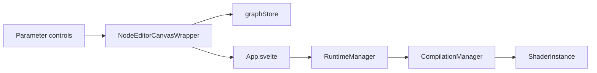

# Parameters: UI to graph to shader

**Last updated:** 2026-05-14

This document describes how **parameter value** changes flow from controls through the graph store to the runtime and shader: which [`ParameterValue`](../../src/data-model/types.ts) types take which path, where **runtime-only** parameters peel off, and when the system chooses **uniform updates** vs **recompile**.

## Pipeline overview

1. **UI** — A control calls `onParameterChange(nodeId, paramName, value)` with `ParameterValue`.
2. **Wrapper** — [`NodeEditorCanvasWrapper.svelte`](../../src/lib/components/editor/NodeEditorCanvasWrapper.svelte) calls `graphStore.updateNodeParameter`, then **`syncCanvasAfterParameterStoreUpdateThenRuntime`** in [`parameterChangeSync.ts`](../../src/lib/components/editor/parameterChangeSync.ts): push `canvas.setGraph` **before** awaiting `onParameterChanged`, then sync again after. If the callback returns a thenable, it is awaited between those canvas updates. This ordering keeps **DomNodeLayer** metrics consistent with the graph the canvas uses (see *Editor canvas ordering* below).
3. **App** — `onParameterChanged` calls `runtimeManager.updateParameter(nodeId, paramName, value, graph)` with the updated graph.
4. **`RuntimeManager`** — Syncs `currentGraph` when `graph` is provided. **Runtime-only** parameters (see below) are handled in JS only (audio, transport, etc.); the method returns without calling `CompilationManager.onParameterChange` for those. Otherwise it calls `compilationManager.onParameterChange(nodeId, paramName, value)`.
5. **`CompilationManager`** — Decides **recompile** vs **uniform-only** update. Non-uniform `ParameterValue` types schedule a **recompile**. For uniform values, when the compile-identity revision matches the revision last paired with `lastGraphHash` and `lastGraphHash` is non-empty, it skips `hashGraph`. When the revision is ahead of that paired value (structure changed, compile not yet applied), it treats the graph as compile-stale **without** per-tick `hashGraph`. When revisions match but `lastGraphHash` is still empty, it compares `hashGraph(this.graph)` to `lastGraphHash`. It also uses a **memoized preview-parameter surface** so nodes outside the live preview slice ignore uniform pushes. Details: [`preview-and-recompilation.md`](./preview-and-recompilation.md).

So: **store → callback → RuntimeManager → (runtime-only handling or) CompilationManager**. The pipeline is typed with full `ParameterValue` end-to-end; narrowing happens only for uniform vs recompile and runtime-only handling.

### Editor canvas ordering

Parameter value changes that go through `handleParameterChange` must **not** skip the `parameterChangeSync` helper: `setGraph` on the node editor canvas must run **before** awaiting async runtime work so DOM node chrome (`getNodeMetrics`) does not lag behind updated parameters.

## `ParameterValue` types

Defined in `data-model/types.ts`:

- `number` — scalar parameters
- `string` — e.g. swizzle pattern (compile-time in GLSL, not a dynamic uniform)
- `[number, number, number, number]` — vec4
- `number[]` — e.g. color stops
- `number[][]` — e.g. audio-analyzer `frequencyBands`

### Matrix: store → shader

| Type | Store / callback | CompilationManager | Shader / effect |
| --- | --- | --- | --- |
| `number` | Yes | Yes | Uniform when no recompile needed; else recompile |
| vec4 tuple | Yes | Yes | Uniform path when compile identity unchanged (see `preview-and-recompilation.md`) |
| `string` | Yes | Yes | Recompile; value baked in generated code |
| `number[]` | Yes | Yes | Recompile (arrays at compile time; see `UniformGenerator`) |
| `number[][]` | Yes | For known runtime-only params, stopped in `RuntimeManager` | Analyzer config, not a uniform |

### Runtime-only parameters

Never get a shader uniform; handled in JS after the store update. Canonical list: [`src/utils/runtimeOnlyParams.ts`](../../src/utils/runtimeOnlyParams.ts). Examples include **audio-file-input** (`filePath`, `autoPlay`) and **audio-analyzer** analyzer configuration (`frequencyBands`, `smoothing`, `fftSize`, remap fields, etc.). Those still use the same **store → callback → RuntimeManager** path; only downstream handling differs (`AudioParameterHandler`, etc.).

### Type narrowing and coercions

- **UI** — Numeric controls may use `snapParameterValue` (`number` only).
- **`RuntimeManager`** — e.g. `autoPlay` coerced with `typeof value === 'number' ? Math.round(value) : 0`.
- **`CompilationManager`** — `isUniformValue` narrows to `number | [number, number, number, number]` for the fast uniform path.
- **`parameterValueCalculator`** — `computeEffectiveParameterValue` is **numeric-oriented** for live port display when connections exist; the shader does not use this helper.

## Adding or changing parameter types

1. Route changes through **`graphStore.updateNodeParameter`** and the app **`onParameterChanged`** callback.
2. For JS-only config, extend **`runtimeOnlyParams.ts`** and handle in **`RuntimeManager`** / audio helpers.
3. For new uniform shapes, extend **`isUniformValue`** / **`ShaderInstance.setUniformValue`** if you want uniform-only updates when the graph is unchanged; otherwise rely on recompile.
4. Keep **`UniformGenerator`** and export paths consistent with runtime-only vs uniform semantics.

## Key files

| Area | File |
| --- | --- |
| Types | `src/data-model/types.ts` |
| Immutable updates | `src/data-model/immutableUpdates.ts` |
| Store | `src/lib/stores/graphStore.svelte.ts` |
| UI wrapper | `src/lib/components/editor/NodeEditorCanvasWrapper.svelte` |
| App wiring | `src/lib/App.svelte` |
| Runtime | `src/runtime/RuntimeManager.ts` |
| Compile / uniforms | `src/runtime/CompilationManager.ts`, `src/runtime/ShaderInstance.ts` |
| Codegen | `src/shaders/compilation/UniformGenerator.ts`, `src/shaders/compilation/MainCodeGenerator.ts` |
| Runtime-only list | `src/utils/runtimeOnlyParams.ts` |
| Effective value (UI) | `src/utils/parameterValueCalculator.ts` |
